**Status:** architecture philosophy document  
**Scope:** server-side atom views, reactivity, durable state, cache invalidation, and state ownership  
**Audience:** implementation agents and humans working on Attune Discovery  
**Related specs:** technical implementation spec, loop architecture doc, performance model

---

## 1. Core thesis

Attune is a durable Effect application with an expensive materialized view of a codebase.

The system should not ask the model to remember the codebase. It should materialize the codebase, prove relationships, record events, project durable state, and then build a fresh reasoning view for the next decision.

The state philosophy is:

```txt
Effect services run the machine.
EventLog records what happened.
SQL projections materialize durable facts.
Reactivity announces which facts changed.
Atoms understand the current state.
Workflow advances from that state.
```

The most important boundary:

```txt
Effect services own execution and resource control.
Atoms own derived views over durable state.
```

Atoms are not the database.  
Atoms are not the worker scheduler.  
Atoms are not the event log.  
Atoms are the server-side reasoning graph over the durable read model.

---

## 2. Why atoms exist in Attune

Attune has a repeating loop:

```txt
expensive work happens
  → durable state changes
  → parts of the run view are stale
  → derived reasoning should update
  → the next DecisionPacket should reflect the new state
```

Without atoms, this becomes an imperative refresh chain:

```txt
rebuildFamilies()
rebuildHypotheses()
recomputeScores()
recomputePlateau()
rebuildDecisionPacket()
rebuildFoldKitScene()
```

That is exactly the cache-invalidation problem we want to avoid.

With atoms, the app describes dependencies instead:

```txt
recentEvidence changed
  → score features recompute
  → plateau recomputes
  → recommendation recomputes
  → DecisionPacket recomputes
  → FoldKit scene recomputes
```

Atoms are chosen because Attune has a graph-shaped read problem:

```txt
one durable fact can affect many derived views
many derived views share the same base facts
the next model packet must be fresh enough to trust
the UI explanation should be derived from the same state as the agent packet
```

The atom graph lets Attune avoid manually coordinating every derived view after every event.

---

## 3. The high-level state stack

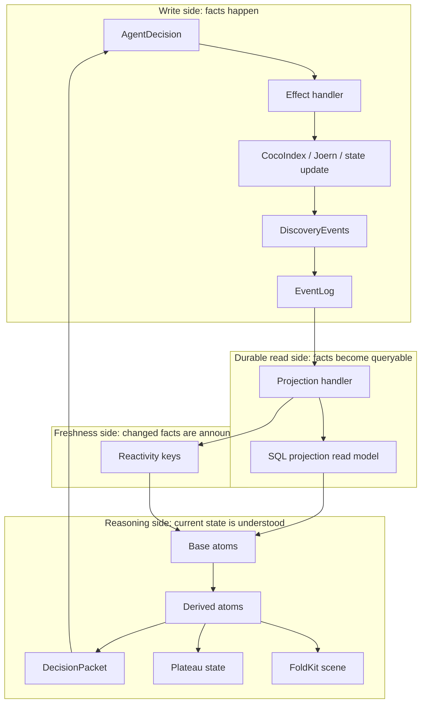

This document focuses on the bottom half:

```txt
SQL projection read model
  → Reactivity keys
  → base atoms
  → derived atoms
  → DecisionPacket / plateau / FoldKit
```

---

## 4. Four kinds of state

Attune should distinguish four kinds of state.

### 4.1 Durable truth

Durable truth is append-only history.

```txt
EventLog
```

It answers:

```txt
What happened?
In what order?
Why did this run reach this state?
Can we replay it?
```

Rules:

```txt
Only DiscoveryEventsLive writes raw events.
Model output never writes directly.
Atoms never write events.
Projection handlers never invent domain facts.
```

### 4.2 Durable read state

Durable read state is queryable projection.

```txt
SQL projections / Postgres tables
```

It answers:

```txt
What is the current materialized state of this run?
What families exist?
What hypotheses exist?
What evidence has been scored?
What review items are open?
```

Rules:

```txt
Projection handlers update SQL projections.
Read-model services query SQL projections.
Atoms read through read-model services.
Do not import table definitions everywhere.
```

### 4.3 Freshness state

Freshness state is not data. It is a signal that some domain facts changed.

```txt
Reactivity keys
```

It answers:

```txt
Which run-scoped facts are stale?
Which base atoms should refetch from durable state?
```

Rules:

```txt
Projection handlers announce changed domain keys.
Base atoms subscribe to the keys they read.
Derived atoms do not manually subscribe unless they directly read durable state.
```

### 4.4 Derived reasoning state

Derived reasoning state is ephemeral and recomputable.

```txt
Atom graph
```

It answers:

```txt
What does the current run state mean?
Which hypothesis is promising?
Is the run plateauing?
What should Pi see next?
What should FoldKit explain?
```

Rules:

```txt
Atoms derive.
Atoms do not mutate durable state.
Atoms do not schedule workers.
Atoms do not own Joern or CocoIndex processes.
Atoms can be disposed and rebuilt.
```

---

## 5. Ownership model

The clearest way to avoid state confusion is to decide who owns each kind of state.

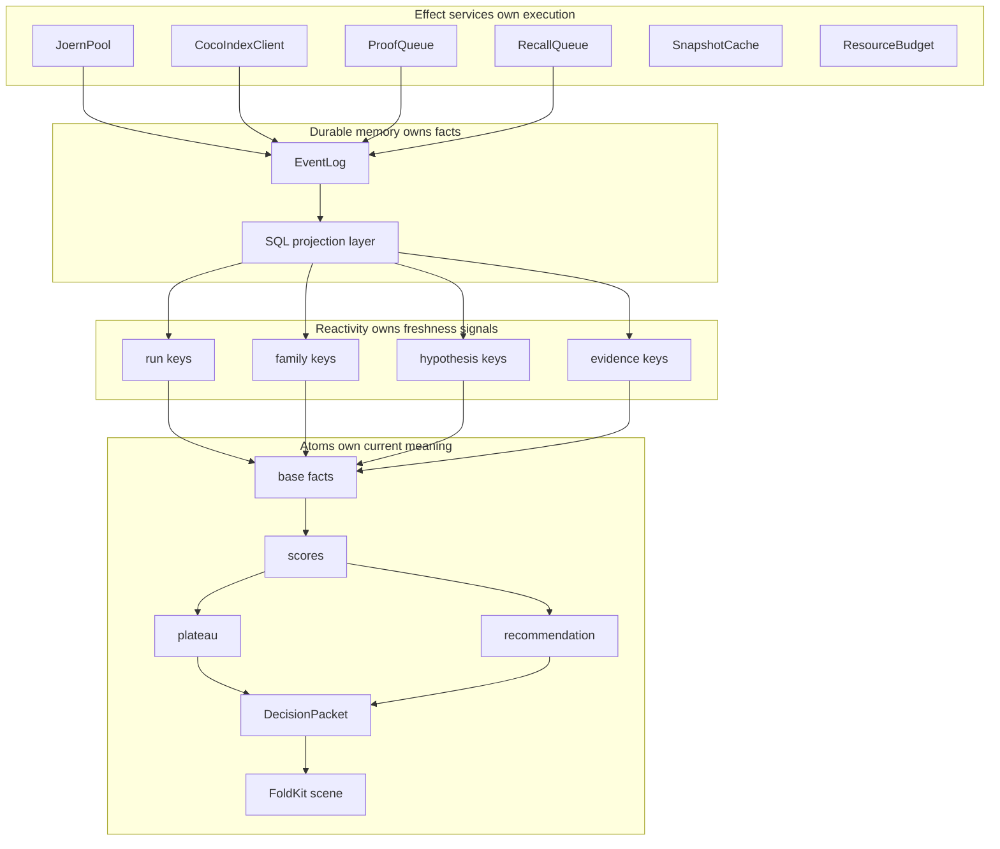

Short version:

```txt
Execution is imperative and supervised.
Facts are durable and replayable.
Freshness is signaled by domain keys.
Meaning is derived by atoms.
```

---

## 6. The rule: refresh base facts, not derived views

The most important atom rule:

```txt
Refresh base leaves only.
Never manually clear every derived projection.
```

Bad pattern:

```txt
projection writes evidence
  → refresh recentEvidence
  → refresh scoreFeatures
  → refresh plateau
  → refresh recommendation
  → refresh decisionPacket
  → refresh FoldKit scene
```

Good pattern:

```txt
projection writes evidence
  → announce evidence(runId) changed
  → recentEvidenceAtom refetches
  → everything downstream recomputes by dependency
```

Diagram:

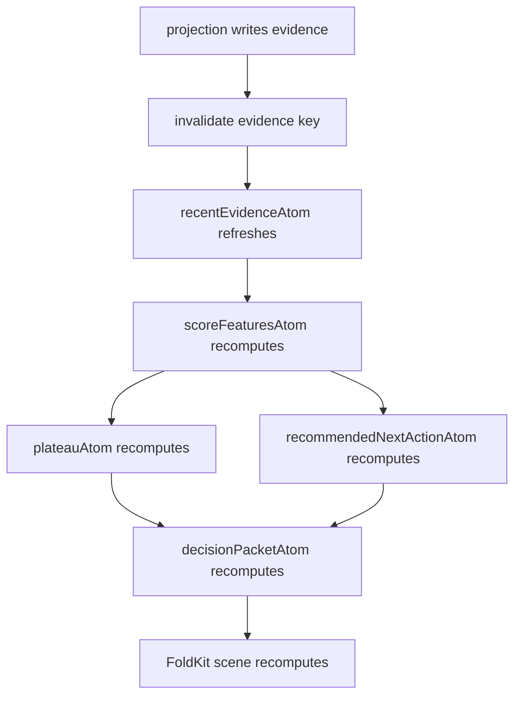

The projection handler should know what durable facts changed.  
The base atom should know what durable facts it reads.  
The derived atom should know which atoms it depends on.  
No layer should know the entire graph.

---

## 7. Reactivity keys are domain keys

Reactivity keys should be coarse, run-scoped, and domain-shaped.

They should not be implementation-shaped.

Good keys:

```txt
run(runId)
runMetrics(runId)
families(runId)
hypotheses(runId)
evidence(runId)
reviewQueue(runId)
anchorSearches(runId)
```

Bad keys:

```txt
refreshDecisionPacketAtom
clearFoldKitCache
invalidateScorePanel
rebuildEverything
```

A reactivity key should describe a changed durable fact, not the thing that must be recomputed.

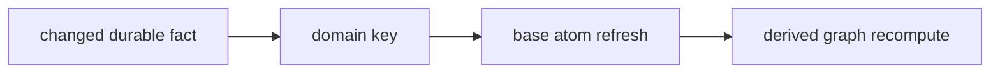

This keeps projection handlers decoupled from atom implementation.

---

## 8. Projection handlers and reactivity

Projection handlers have two responsibilities:

```txt
1. Write the durable read model.
2. Announce which domain keys changed.
```

They should not:

```txt
- build DecisionPackets
- manually recompute score features
- call Pi
- construct FoldKit scenes
- know the whole atom graph
```

Conceptual shape:

```txt
EventLog event
  → projection handler
  → SQL projections write
  → Reactivity invalidates changed keys
  → base atoms refresh later
```

Ordering rule:

```txt
Write durable state first.
Then announce freshness.
Then atoms refetch from durable state.
```

That prevents atoms from refreshing before the new state exists.

---

## 9. Base atoms

Base atoms are the only atoms that should normally read durable state.

Examples:

```txt
runAtom(runId)
runMetricsAtom(runId)
activeFamiliesAtom(runId)
activeHypothesesAtom(runId)
recentEvidenceAtom(runId)
reviewQueueAtom(runId)
anchorSearchesAtom(runId)
```

Base atoms are:

```txt
Effectful
run-scoped
reactive to domain keys
thin wrappers over read-model services
```

They are not business logic buckets.

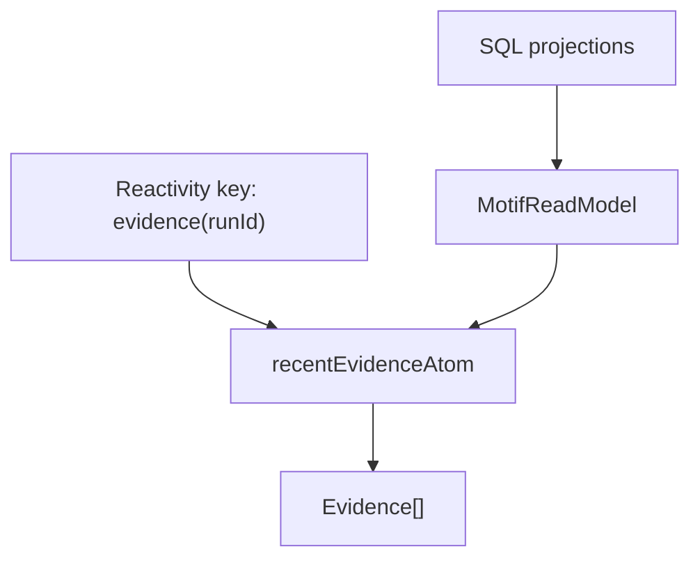

A good base atom reads like:

```txt
Given a runId, fetch this durable read-model slice.
Refresh when this domain key changes.
```

---

## 10. Derived atoms

Derived atoms should be pure or mostly pure transformations over base atoms and other derived atoms.

Examples:

```txt
queuedHypothesesAtom
runScoreFeaturesAtom
plateauAtom
recommendedNextActionAtom
decisionPacketAtom
evidenceGraphAtom
discoveryRunSceneAtom
```

Derived atoms answer questions like:

```txt
Which hypotheses are queued?
How strong is the evidence?
Is the run plateauing?
What action is currently recommended?
What packet should Pi receive?
What should FoldKit show?
```

Derived atom graph:

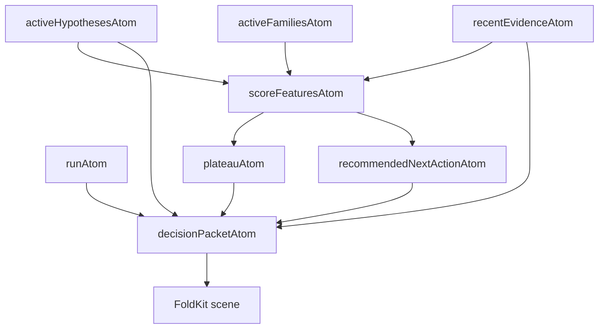

Derived atoms should not write durable state.

If a derived atom discovers something interesting, it should expose that fact in the view. A command handler or workflow can then decide whether to act.

---

## 11. DecisionPacket as the central derived view

The `DecisionPacket` is the most important derived atom output.

It is the model's world for one turn.

```txt
DecisionPacket = current state + available moves + deterministic hints
```

It should be rebuilt from durable projections and derived atoms, not from model memory.

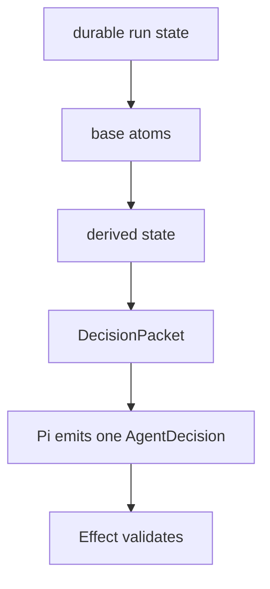

The `DecisionPacket` should include enough information for Pi to choose one next move, but not so much that Pi becomes a second state manager.

It may include:

```txt
current families
queued hypotheses
recent evidence
score features
plateau state
available actions
deterministic recommendation
valid IDs
known templates
human review constraints
```

It should not include:

```txt
raw EventLog history
full durable projection tables
full codebase content
internal atom graph mechanics
worker pool implementation details
```

---

## 12. FoldKit scenes come from the same graph

FoldKit should not query the database separately and build a different interpretation of the run.

The UI explanation surface and the agent packet should share the same derived state.

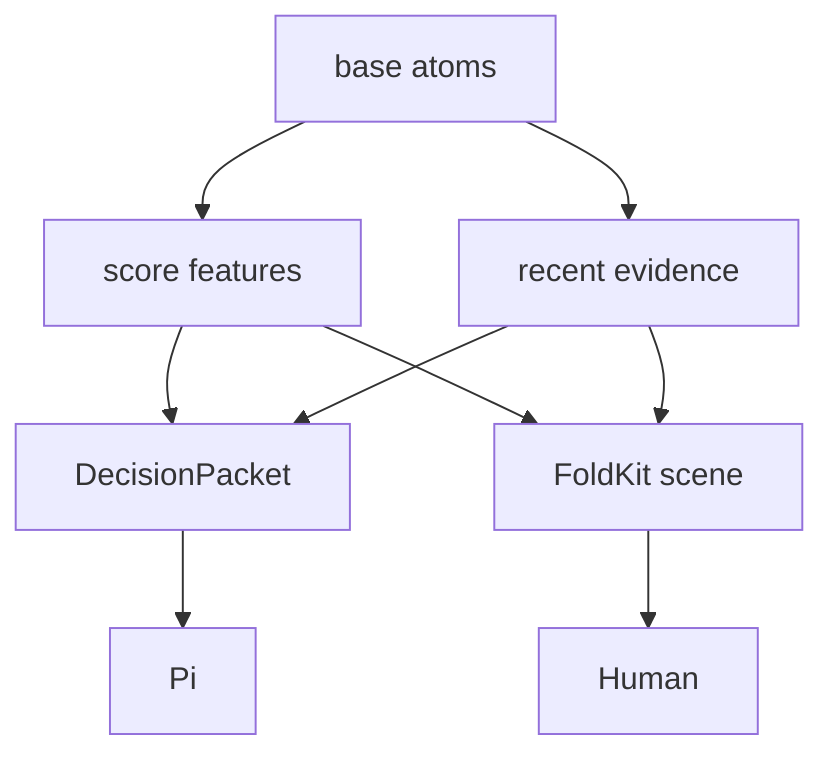

This creates a useful product property:

```txt
The human sees the same state shape the model acted on.
```

That makes explanations, debugging, replay, and review much easier.

---

## 13. Atoms and the performance model

Attune is not primarily inference-bound.

It is evidence-bound and memory-heavy:

```txt
CocoIndex indexing
Joern CPG loading
Joern template execution
anchor/evidence caching
snapshot materialization
```

Atoms do not solve raw performance.

Effect services solve resource execution:

```txt
worker pools
queues
semaphores
timeouts
caches
leases
backpressure
```

Atoms solve read-side complexity:

```txt
fresh packet construction
score recomputation
plateau detection
explanation scene derivation
cache invalidation for derived views
```

The boundary:

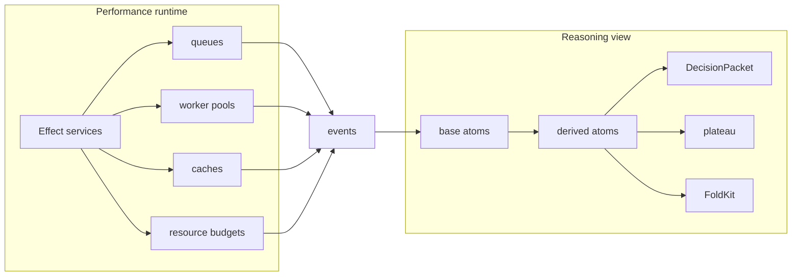

Do not use atoms to run the machine.

Use atoms to understand the machine's current state.

---

## 14. Memory ownership

Attune should avoid duplicating the materialized code world.

The ownership model:

```txt
RepoSnapshot owns expensive materialization.
DiscoveryRun owns temporary reasoning state.
EventLog owns history.
SQL projections owns durable projections.
Atoms own disposable derived views.
```

Diagram:

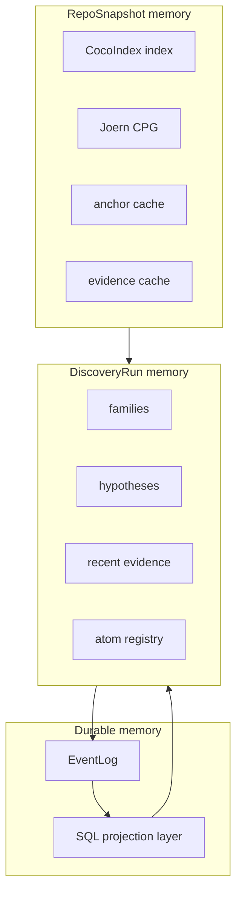

Rules:

```txt
Share snapshot-level indexes and CPGs when possible.
Keep one atom registry per active run.
Dispose run registries on completion.
Store references and bounded snippets, not repeated full code.
FoldKit scenes are derived, not durable copies.
```

---

## 15. Run-scoped atom registries

Atoms should be scoped by run.

Each active discovery run gets a registry:

```txt
run started
  → registry created lazily
run active
  → registry reused across iterations
run completed / failed / cancelled
  → registry disposed
```

Why run-scoped?

```txt
prevents cross-run cache contamination
makes memory lifecycle explicit
allows per-run inspection
allows per-run disposal
keeps reasoning views local to a run
```

Diagram:

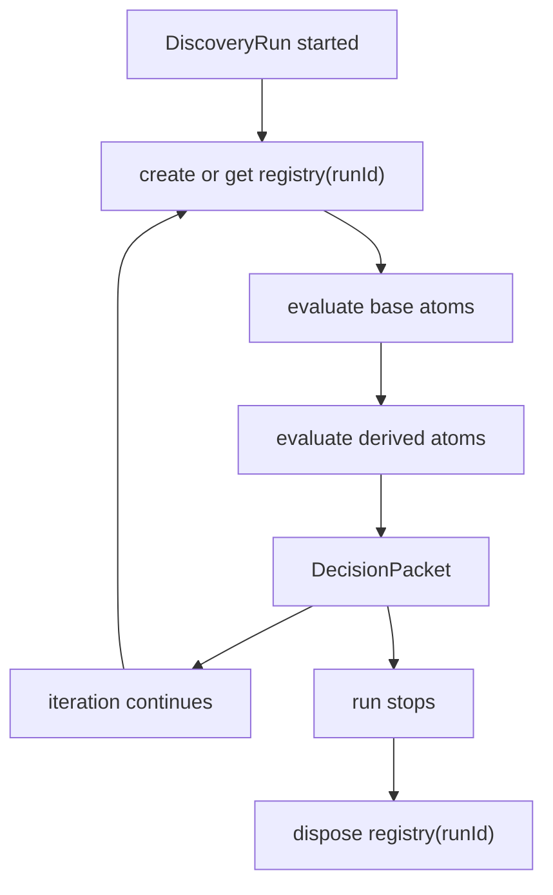

The registry is hot memory. It should not outlive the run unless explicitly retained for debugging.

---

## 16. What belongs in atoms

Good atom responsibilities:

```txt
derive score features
derive plateau state
derive recommended next action
build DecisionPacket
build FoldKit scene data
build evidence graph view
select recent evidence
select queued hypotheses
summarize family health
```

Bad atom responsibilities:

```txt
start Joern process
run CocoIndex indexing
write EventLog event
mutate SQL projections
promote rule candidate
send model request
own worker queue
perform cache eviction
hold global repo snapshot state
```

Rule of thumb:

```txt
If it changes the world, it is not an atom.
If it explains the world, it can be an atom.
```

---

## 17. Writes are explicit commands

The write side should always remain explicit.

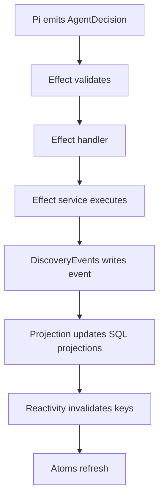

No hidden write path should bypass this loop.

Never:

```txt
atom derives surprising fact
  → atom writes event
```

Instead:

```txt
atom derives recommendation
  → workflow/handler reads recommendation
  → explicit command/event if needed
```

This preserves auditability.

---

## 18. Reactivity across processes

In v0, reactivity can be in-process.

That assumes:

```txt
projection handler and atom registry share the same Reactivity service instance
```

Later, if projections and atom views run in different processes, reactivity needs a bridge.

Options:

```txt
Postgres LISTEN/NOTIFY
Effect Cluster messages
Redis pub/sub
EventLog subscription
workflow signal
```

The philosophy does not change.

```txt
Projection writes durable state.
Projection announces changed domain keys.
Base atoms refresh from durable state.
Derived atoms recompute.
```

Only the transport for freshness signals changes.

---

## 19. Replay and atoms

Replay should rebuild durable projections first.

Then atoms should derive the same view from the replayed read model.

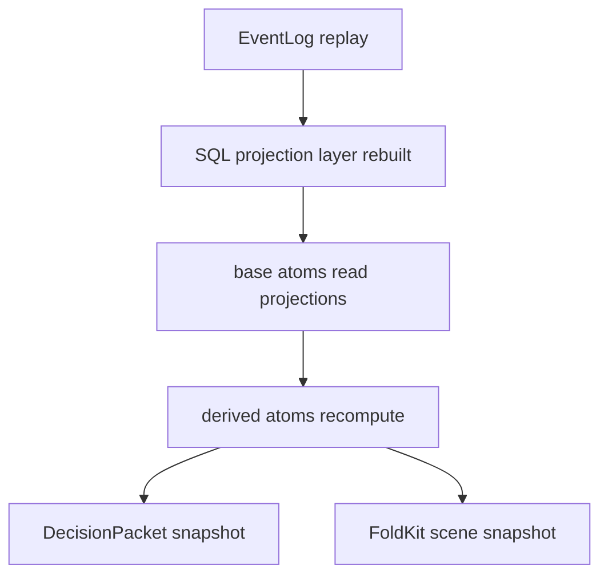

This is a critical test of the architecture.

If atoms contain hidden state that cannot be replayed from durable projections, they are doing too much.

Replay invariant:

```txt
Given the same EventLog and projection code,
the same run-scoped atom views should be derivable.
```

---

## 20. Testing philosophy

Test the state model in layers.

### 20.1 Projection tests

```txt
event in
  → SQL projections rows changed
  → correct Reactivity keys announced
```

### 20.2 Base atom tests

```txt
SQL projections fixture
  → base atom value
```

### 20.3 Derived atom tests

```txt
base atom fixtures
  → score features / plateau / packet
```

### 20.4 Refresh tests

```txt
1. evaluate DecisionPacket
2. write projection change
3. announce domain key
4. base atom refreshes
5. derived packet changes
```

### 20.5 Replay tests

```txt
1. replay EventLog into empty projections
2. evaluate atom graph
3. compare packet/scene snapshots
```

### 20.6 Memory lifecycle tests

```txt
1. create registry for run
2. evaluate atoms
3. complete run
4. dispose registry
5. assert no retained registry nodes
```

---

## 21. Failure modes this prevents

This architecture is designed to prevent several common failures.

### 21.1 Model as state manager

Bad:

```txt
The model remembers what happened and decides from chat history.
```

Good:

```txt
The app rebuilds DecisionPacket from durable state every turn.
```

### 21.2 Manual derived-state invalidation

Bad:

```txt
Every handler knows every view it must refresh.
```

Good:

```txt
Projection announces changed domain keys.
Base atoms refresh.
Derived atoms recompute.
```

### 21.3 UI and agent disagree

Bad:

```txt
Pi sees one state shape.
FoldKit shows another.
```

Good:

```txt
Pi packet and FoldKit scene are derived from the same atom graph.
```

### 21.4 Hidden writes

Bad:

```txt
Derived view writes state as a side effect.
```

Good:

```txt
Only command handlers write events through DiscoveryEvents.
```

### 21.5 Memory leaks from long runs

Bad:

```txt
Run-derived views live forever.
```

Good:

```txt
One registry per active run, disposed on completion.
```

---

## 22. When atoms should be questioned

Atoms are useful, but not sacred.

Question the atom layer if:

```txt
DecisionPacketAtom is harder to understand than an imperative builder.
Refresh behavior becomes mysterious.
Tests require too much runtime ceremony.
Atom graph memory grows without clear ownership.
Base atoms start doing business writes.
Derived atoms start managing workers.
```

The fallback is acceptable:

```txt
Replace atom-derived views with an imperative DecisionPacketBuilder.
Keep Effect services, EventLog, SQL projections, and Workflow unchanged.
```

This is a good architectural sign.

Atoms are high-upside for read-side legibility, but not an existential commitment.

---

## 23. V0 policy

For v0, keep the atom system small.

Start with:

```txt
runAtom
activeFamiliesAtom
activeHypothesesAtom
recentEvidenceAtom
runScoreFeaturesAtom
plateauAtom
recommendedNextActionAtom
decisionPacketAtom
```

Maybe add:

```txt
discoveryRunSceneAtom
reviewQueueAtom
```

Avoid in v0:

```txt
full graph inspector
fine-grained per-evidence-key invalidation
global atom registry
long-lived scene caches
worker-pool atoms
cache-eviction atoms
cross-process reactivity bridge
```

The v0 purpose is to prove:

```txt
Projection writes durable state.
Reactivity invalidates a coarse domain key.
Base atoms refresh.
Derived packet changes.
Workflow advances from the new packet.
```

---

## 24. The final model

Attune's state system should feel like this:

```txt
The write side is boring.
The durable read side is boring.
The freshness layer is explicit.
The reasoning view is declarative.
The workflow advances from that view.
```

Final architecture sentence:

```txt
Attune uses Effect services to execute expensive codebase operations, EventLog and SQL projections to remember their durable results, Reactivity to announce which run-scoped facts changed, and server-side atoms to derive the current reasoning view that feeds Pi, FoldKit, plateau detection, and the next workflow step.
```

Shortest version:

```txt
Effect runs the machine.
EventLog remembers the machine.
SQL projections materialize the machine.
Reactivity tells us what changed.
Atoms explain the machine.
```