**Purpose:** explain the core discovery loop at a slightly technical level without restating the full implementation spec.

This document focuses on the loop: how Attune moves from code search, to motif hypotheses, to proof, to memory, to reactive freshness, to the next decision.

---

## 1. The basic model

Attune Discovery is a bounded agentic loop over a codebase.

The model does not own truth. The model proposes the next move. The app validates that move, executes deterministic work, records what happened, projects durable read state, announces which read-model keys changed, and rebuilds the next view.

```txt
CocoIndex finds.
Pi proposes.
Effect validates.
Joern proves.
EventLog remembers.
Drizzle materializes.
Reactivity invalidates.
Atoms reason.
Workflow advances.
Humans promote.
```

Legend used in diagrams:

```txt
[D] deterministic system work
[A] agentic judgment
[P] proof / structural validation
[H] human gate
[R] reactive freshness / invalidation
```

---

## 2. Core semantic loop

This is the fundamental loop. It is still the best mental model for the product.

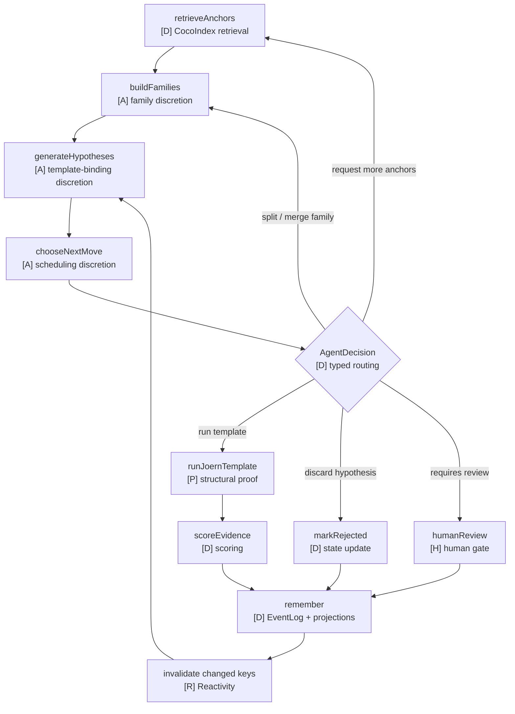

The loop says:

1. Search finds anchors.
2. The agent groups anchors into families.
3. The agent proposes hypotheses using known proof templates.
4. The agent emits exactly one `AgentDecision`.
5. Effect validates and routes that decision.
6. Joern proves structural hypotheses.
7. Evidence is scored and remembered.
8. Projections update durable read state.
9. Reactivity invalidates the changed run-scoped view keys.
10. The next view is rebuilt from memory.

---

## 3. Runtime loop

The semantic loop above becomes an Effect application loop.

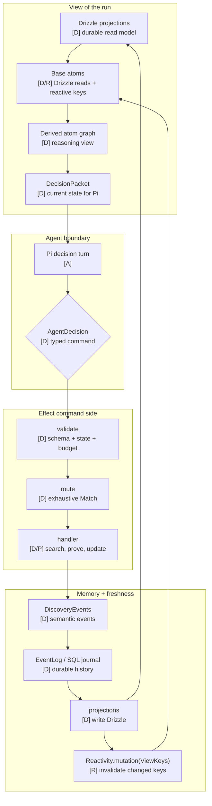

The important shift is that Pi does not carry the loop in chat memory. Pi sees a fresh `DecisionPacket` each turn. The app owns the run state.

Reactivity is the freshness bridge between durable projections and atom views. Projection handlers announce changed domain keys; base atoms subscribe to those keys; derived atoms recompute through normal dependencies.

---

## 4. AgentDecision routing loop

`AgentDecision` is the only thing Pi emits.

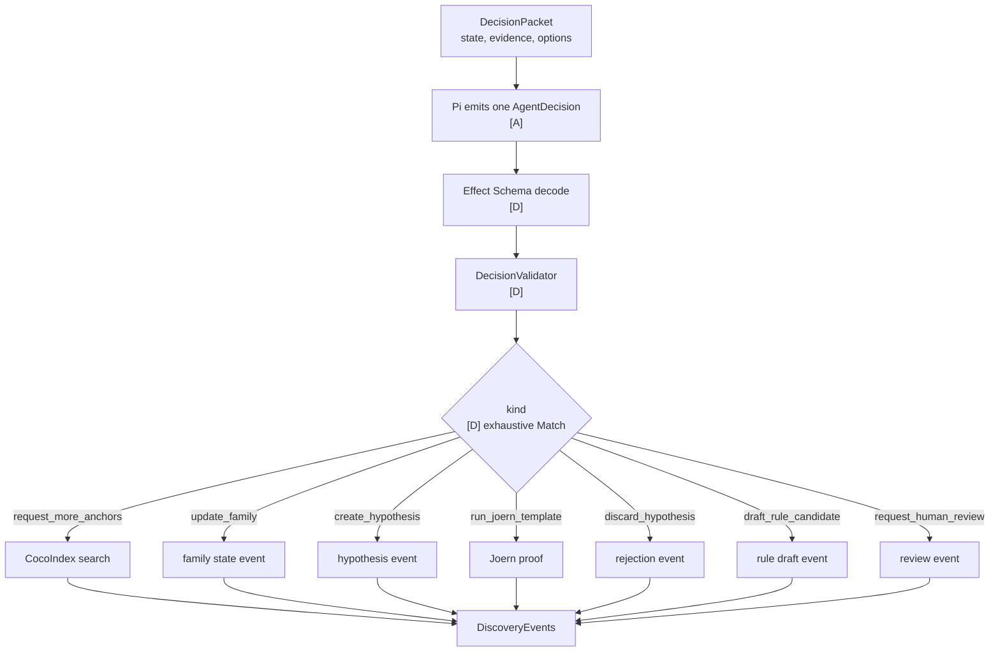

The validator checks:

```txt
- Does the decision kind exist?
- Do referenced IDs exist?
- Is the target in the right state?
- Is the template known?
- Are template bindings compatible?
- Is the run within budget?
- Is this decision repeated too many times?
- Does this action require evidence or review?
```

---

## 5. Proof loop

Joern is only called after the app has a known hypothesis and a known template.

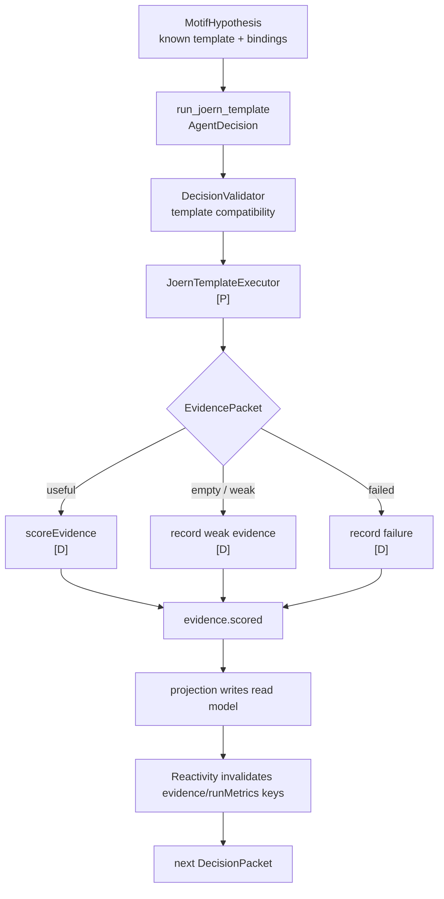

Pi does not generate arbitrary Joern queries in v0. It chooses from known templates.

This keeps Joern as a proof worker, not an agent scratchpad.

---

## 6. Memory and freshness loop

Events are the durable facts. Drizzle tables are read models. Reactivity is the in-process freshness bus. Atoms are derived views.

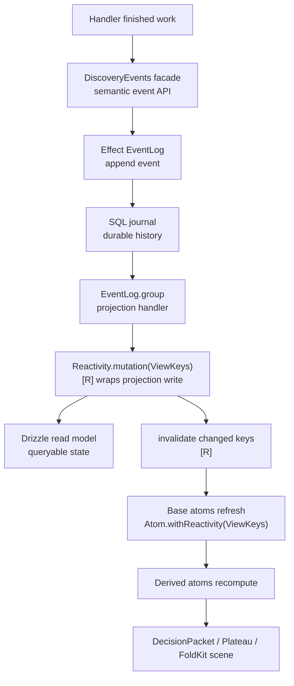

The write side stays boring:

```txt
AgentDecision
  → Validator
  → Router
  → Handler
  → DiscoveryEvents
  → EventLog
```

The durable read side stays boring:

```txt
EventLog.group projection
  → Reactivity.mutation(keys)(Drizzle write)
  → Drizzle read model
```

The reasoning read side becomes useful:

```txt
Drizzle projections
  → reactive base atoms
  → derived atom graph
  → decision packet
  → plateau state
  → explanation scene
```

The key ordering rule:

```txt
Write Drizzle first.
Then invalidate Reactivity keys.
Then atoms refresh from durable state.
```

That is why projection handlers should use `Reactivity.mutation(keys)(effect)` instead of manually invalidating before or during the write.

---

## 7. Reactive freshness loop

Reactivity connects projection writes to atom refreshes without making projection handlers know about the atom graph.

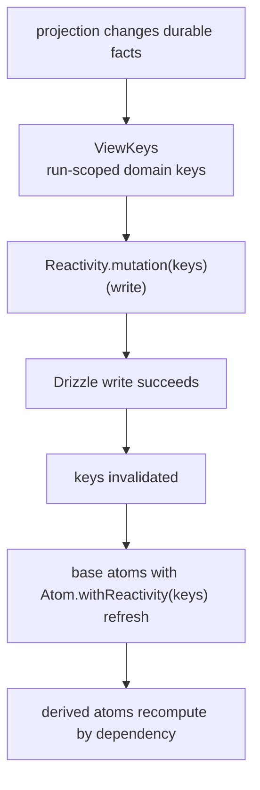

Example keys:

```ts
export const ViewKeys = {
  run: (runId: RunId) => ({ run: [runId] }),
  runMetrics: (runId: RunId) => ({ runMetrics: [runId] }),
  families: (runId: RunId) => ({ families: [runId] }),
  hypotheses: (runId: RunId) => ({ hypotheses: [runId] }),
  evidence: (runId: RunId) => ({ evidence: [runId] }),
  reviewQueue: (runId: RunId) => ({ reviewQueue: [runId] }),
}
```

Projection handlers announce changed domain keys:

```ts
Reactivity.mutation({
  ...ViewKeys.evidence(payload.runId),
  ...ViewKeys.runMetrics(payload.runId),
})(
  Effect.gen(function* () {
    const readModel = yield* MotifReadModel

    yield* readModel.insertEvidenceScore({
      runId: payload.runId,
      hypothesisId: payload.hypothesisId,
      evidencePacketId: payload.evidencePacketId,
      supportScore: payload.supportScore,
      structuralScore: payload.structuralScore,
      semanticScore: payload.semanticScore,
      actionabilityScore: payload.actionabilityScore,
    })

    yield* readModel.updateRunMetricsFromEvidence({
      runId: payload.runId,
      evidencePacketId: payload.evidencePacketId,
    })
  }),
)
```

Base atoms subscribe to domain keys:

```ts
export const recentEvidenceAtom = Atom.family((runId: RunId) =>
  DiscoveryRuntime.atom(
    Effect.gen(function* () {
      const readModel = yield* MotifReadModel
      return yield* readModel.listRecentEvidence({ runId, limit: 50 })
    }),
  ).pipe(
    Atom.withLabel(`recentEvidence:${runId}`),
    Atom.withReactivity(ViewKeys.evidence(runId)),
  ),
)
```

Derived atoms do not need Reactivity keys if they depend on reactive base atoms.

```txt
recentEvidenceAtom(runId)
  → runScoreFeaturesAtom(runId)
  → plateauAtom(runId)
  → decisionPacketAtom(runId, iteration)
  → discoveryRunSceneAtom(runId, iteration)
```

Responsibility split:

```txt
Projection handler:
  knows what durable facts changed

Base atom:
  knows what durable facts it reads

Derived atom:
  knows what atoms it depends on

Workspace:
  owns run-scoped registry lifecycle
```

The one wiring rule:

```txt
Projection handlers and atom runtimes must share the same Reactivity service instance.
```

Reactivity is in-process. If the projection worker and atom registry live in different processes later, bridge invalidations through Postgres LISTEN/NOTIFY, Effect Cluster, Redis, or EventLog subscriptions.

---

## 8. Reasoning view loop

The atom graph is not memory. It is the current reasoning view over memory.

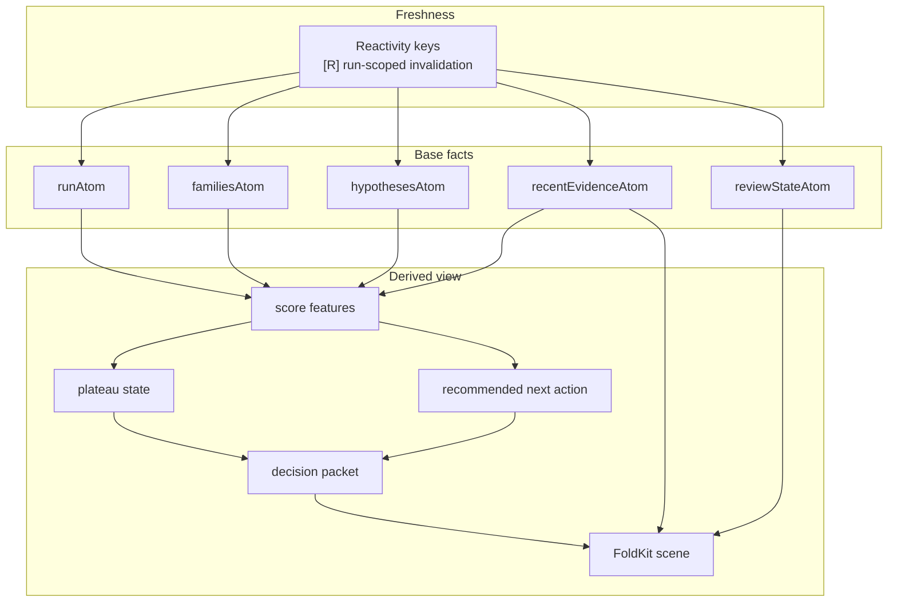

Projection handlers should not manually refresh every derived view. They announce changed domain keys. Base atoms refresh if their keys changed. Derived atoms recompute from dependencies.

```txt
Projection changes evidence.
  → Reactivity invalidates evidence(runId)
  → recentEvidenceAtom(runId) refreshes
  → score features recompute
  → plateau recomputes
  → next packet recomputes
```

The workflow reads the atom graph; it does not manage cache invalidation.

---

## 9. Workflow loop

The workflow owns the long-running run.

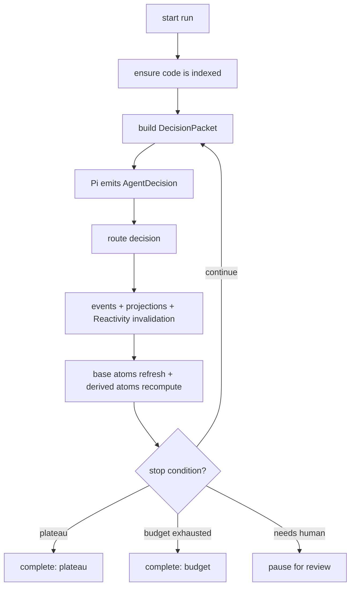

The loop stops when:

```txt
- plateau is detected
- budget is exhausted
- human review is required
- the run completes normally
- an unrecoverable failure occurs
```

The run is not trying to make the model reason forever. It is trying to discover until marginal evidence yield drops.

---

## 10. Prompt boundary

Most of the architecture should not be in the Pi prompt.

The prompt should define the agent's role and limits. The `DecisionPacket` should contain the current state.

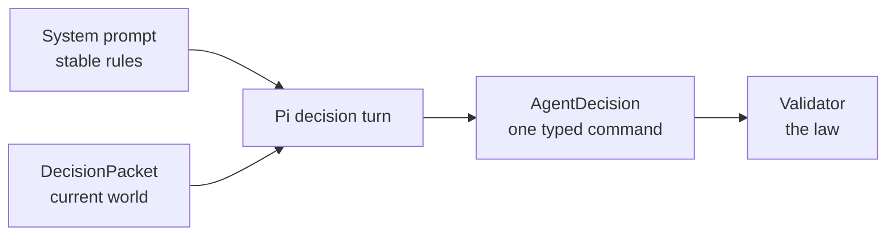

System prompt = constitution.

DecisionPacket = world state.

Validator = law.

Reactivity and atoms are deliberately not part of the prompt. They are runtime machinery that ensures the packet is fresh and deterministic enough for the model to use.

---

## 11. Minimal Pi system prompt

```txt
You are the Attune Discovery planner.

You are not the source of truth.
You may not mutate state directly.
You may not promote rules.
You may not declare violations.
You may not invent IDs, evidence, templates, or Joern queries.

Your only job is to read the provided DecisionPacket and emit exactly one AgentDecision through the emit_agent_decision tool.

Use request_more_anchors when more semantic recall is needed.
Use update_family when anchors need to be split, merged, accepted, rejected, or assigned roles.
Use create_hypothesis when families are coherent enough to bind to a known template.
Use run_joern_template only for existing hypotheses and known templates.
Use discard_hypothesis when a hypothesis is redundant, out of scope, contradicted, or weak.
Use draft_rule_candidate only when evidence is strong and human review is required.
Use request_human_review when the next safe step requires human judgment.

Joern evidence is structural truth.
EventLog/Postgres state is memory.
The current DecisionPacket is the only state you should trust.
```

Optional decision priority rubric:

```txt
1. If plateau is likely and evidence is strong, prefer draft_rule_candidate or request_human_review.
2. If a high-priority hypothesis is queued and has compatible bindings, prefer run_joern_template.
3. If families are noisy or mixed, prefer update_family.
4. If evidence is missing for a required role, prefer request_more_anchors.
5. If a hypothesis is duplicated, contradicted, or out of scope, prefer discard_hypothesis.
6. If unsure between unsafe and review, prefer request_human_review.
```

---

## 12. Component responsibilities

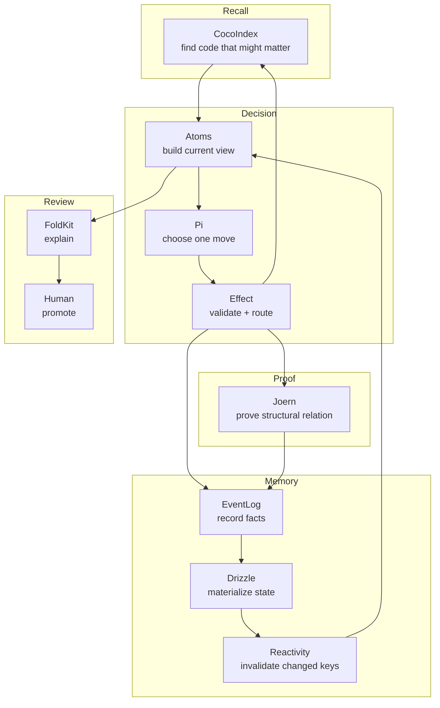

Each major component has a narrow job:

```txt
CocoIndex: recall
Pi: judgment
Effect: legality and execution
Joern: proof
EventLog: history
Drizzle: materialized read state
Reactivity: freshness signals after durable mutations
Atoms: current reasoning view
Workflow: long-running control
FoldKit: explanation
Human: legitimacy
Nx: source-code grammar
```

---

## 13. Why this loop is stable

The system is stable because each uncertain step is surrounded by deterministic boundaries.

```mermaid
flowchart LR
  A["fuzzy recall"] --> B["typed anchors"]
  B --> C["fuzzy judgment"]
  C --> D["typed AgentDecision"]
  D --> E["deterministic validation"]
  E --> F["structural proof"]
  F --> G["scored evidence"]
  G --> H["durable memory"]
  H --> I["reactive freshness"]
  I --> J["derived view"]
```

The model is useful because it makes semantic choices.

The app is reliable because the model can only speak through a typed command.

The read side is stable because projection writes announce domain keys, base atoms subscribe to those keys, and derived atoms recompute through declared dependencies instead of manual cache invalidation.

---

## 14. Runtime safety summary

The runtime safety story is:

```txt
Event sourcing makes state transitions auditable.
Effect makes execution bounded and typed.
Drizzle makes durable read state queryable.
Reactivity makes freshness ordered and explicit.
Atoms make derived reasoning declarative.
Workflow makes long runs resumable.
```

The two key failure modes this prevents are:

```txt
1. The model becoming the state manager.
2. Derived state becoming invisible, stale, and manually invalidated.
```

The model emits bounded commands. The event log records facts. Drizzle materializes facts. Reactivity announces changed fact keys. Atoms derive current reasoning state. Workflow advances from that state.

---

## 15. Final architecture sentence

Attune Discovery is a durable Effect app that repeatedly builds a typed, reactively fresh view of the codebase, asks a bounded agent for one next move, validates that move, proves important hypotheses with Joern, records the outcome as events, projects durable read state through Drizzle, invalidates changed view keys through Reactivity, and rebuilds the next atom-derived view until the run plateaus or needs human judgment.