**Scope:** CocoIndex and `joern-effect` inside Attune Discovery.  
**Altitude:** slightly technical architecture model, not a full implementation spec.  
**Purpose:** explain how Attune moves from semantic code recall to structural proof without letting the agent become the source of truth.

---

## 1. Core idea

Attune separates **finding code that might matter** from **proving relationships that are structurally true**.

```txt
CocoIndex finds candidates.
joern-effect proves relationships.
Effect coordinates the handoff.
Pi chooses the next move, but never owns truth.
```

The system has two complementary engines:

```txt
CocoIndex:
  semantic recall over the codebase
  broad, fuzzy, fast enough to explore

joern-effect:
  structural proof over a code property graph
  narrow, deterministic, evidence-producing
```

The loop is powerful because Attune does not ask one tool to do everything.

```txt
semantic similarity is not proof
proof without candidate generation is blind
agent judgment without validation is unsafe
```

---

## 2. Roles

```txt
CocoIndex:
  Finds anchors that might be relevant.

AnchorCard:
  Normalized Attune boundary object for code search results.

Pi:
  Chooses one next move from the current DecisionPacket.

Effect:
  Validates, routes, records, and orchestrates.

joern-effect:
  Executes known structural templates and returns EvidencePacket.

EventLog / Drizzle / Atoms:
  Remember and rebuild the next decision view.
```

Shortest subsystem mantra:

```txt
CocoIndex recalls.
Pi selects.
Effect validates.
joern-effect proves.
Evidence teaches the next search.
```

Legend used in diagrams:

```txt
[D] deterministic system work
[A] agentic judgment
[P] proof / structural validation
[H] human gate
[R] reactive freshness / invalidation
```

---

## 3. The recall-to-proof loop

This is the core loop between CocoIndex and joern-effect.

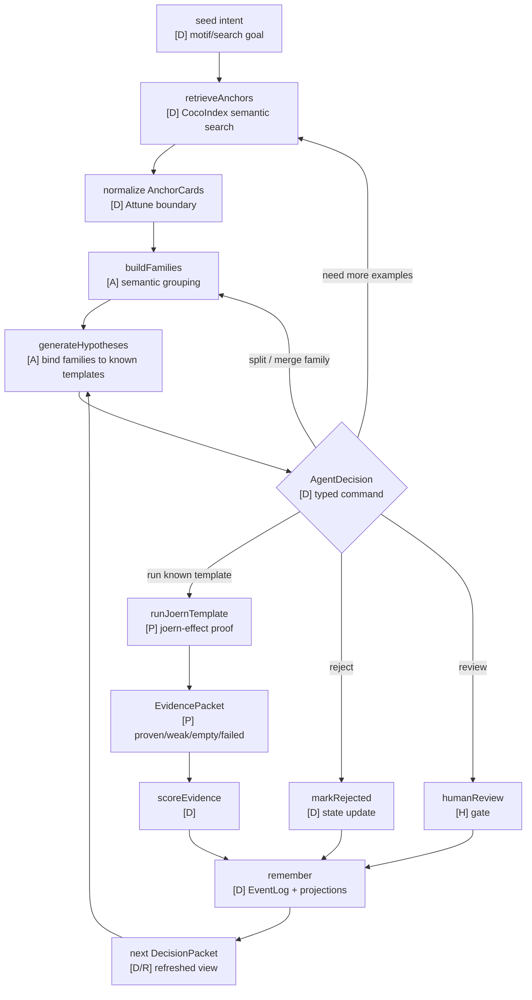

The important feedback path is:

```txt
Joern evidence changes what we search for next.
CocoIndex anchors change what we ask Joern to prove next.
```

---

## 4. Why CocoIndex exists

CocoIndex is the **recall layer**.

It answers questions like:

```txt
Where are possible sources?
Where are possible sinks?
What wrappers look semantically similar?
What validators exist near this concept?
What are near-misses or counterexamples?
What local vocabulary does this repo use?
```

CocoIndex is valuable because Attune should not start with Joern queries alone. Pure structural queries are only as good as the names and shapes we already know how to ask for.

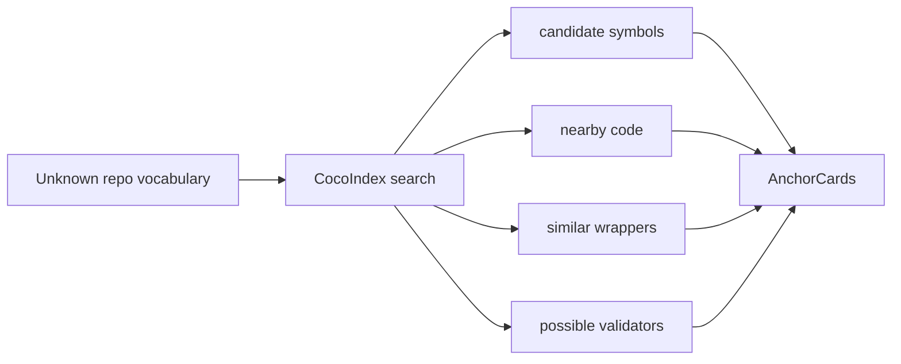

CocoIndex should not decide truth.

```txt
CocoIndex can say:
  this looks like a command runner
  this looks like validation
  this looks like request input

CocoIndex cannot say:
  this value reaches that sink
  this wrapper always calls spawn
  this path is validated
```

That proof belongs to Joern.

---

## 5. Why joern-effect exists

Joern is the **proof layer**.

It answers questions like:

```txt
Does this wrapper call a primitive?
Does this source reach this sink?
Does validation happen before use?
Does this boundary crossing exist structurally?
What code path explains the relationship?
```

`joern-effect` exists to make Joern usable from the Attune TypeScript/Effect app:

```txt
Effect service boundary
known template catalog
generated binding schemas
generated evidence schemas
safe query rendering
evidence decoding
lifecycle management
```

The agent does not write arbitrary Joern queries in v0. It chooses from known templates.

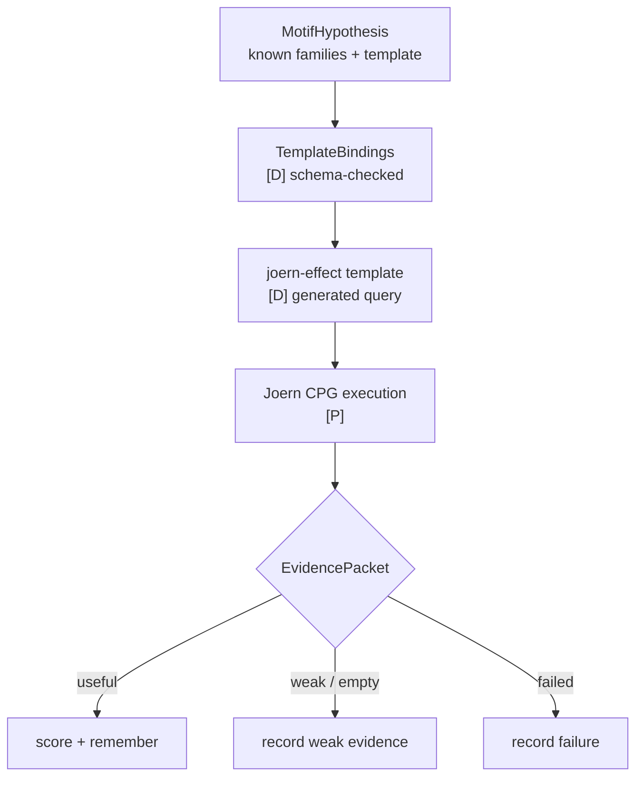

---

## 6. The handoff object: AnchorCard

CocoIndex results should be normalized before the rest of Attune sees them.

```txt
CocoIndex result
  → AnchorCard
  → family grouping
  → hypothesis binding
  → Joern template input
```

Conceptually, an `AnchorCard` says:

```txt
This is a piece of code that might play a role.
Here is where it lives.
Here is what it appears to be.
Here is enough text/context for the agent to reason about it.
Here are stable IDs for later proof.
```

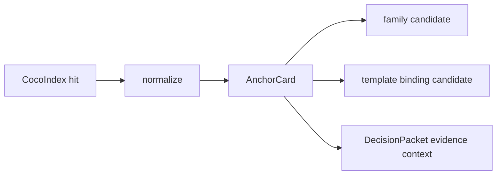

The goal is to avoid leaking CocoIndex’s raw shape into the rest of the product.

---

## 7. The proof object: EvidencePacket

Joern results should also be normalized.

```txt
Joern rows / graph paths
  → EvidencePacket
  → scoring
  → projections
  → atoms
  → explanation scenes
```

Conceptually, an `EvidencePacket` says:

```txt
This hypothesis was tested.
This template was used.
These nodes, paths, files, or flows were found.
This proof was useful, weak, empty, or failed.
Here is enough structure to explain it later.
```

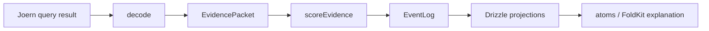

The evidence packet is what prevents Attune from becoming a vague semantic search tool. It gives the product a proof artifact.

---

## 8. Template loop

Attune should treat Joern templates as a small, typed proof language.

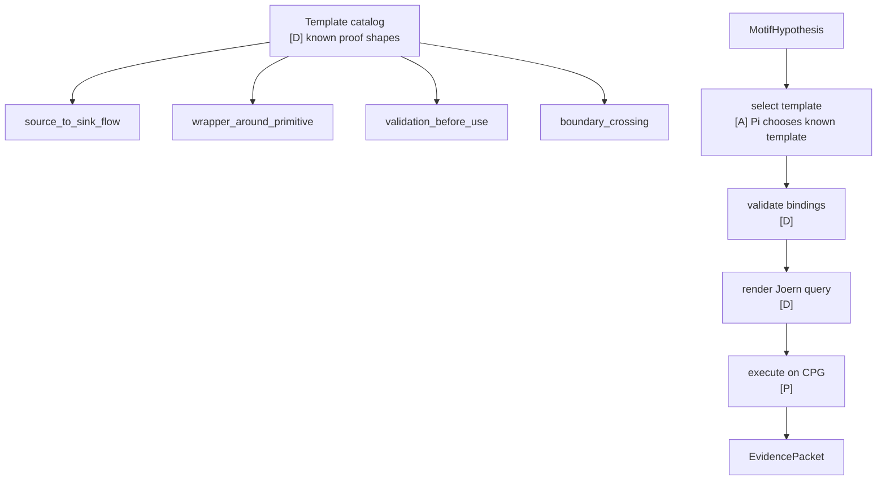

Pi can choose:

```txt
Run source_to_sink_flow for hypothesis hyp_123.
Run wrapper_around_primitive for hypothesis hyp_456.
```

Pi cannot choose:

```txt
Here is arbitrary Joern query text.
Run this custom Scala expression.
```

This is a safety boundary and a product boundary.

---

## 9. How evidence improves recall

Evidence does not just prove or reject a hypothesis. It changes the next recall strategy.

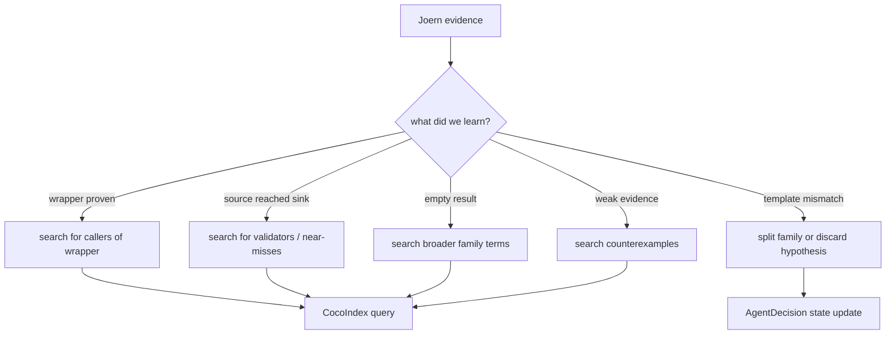

This is where the loop gets interesting.

CocoIndex is not only the starting point. It is also the way the system reacts to what Joern finds.

---

## 10. CocoIndex and Joern are complementary

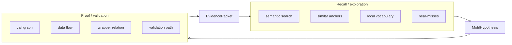

CocoIndex optimizes for **recall**.

Joern optimizes for **structural precision**.

Attune sits between them and turns their outputs into motif memory.

---

## 11. Effect boundary

Effect is the coordination layer between recall and proof.

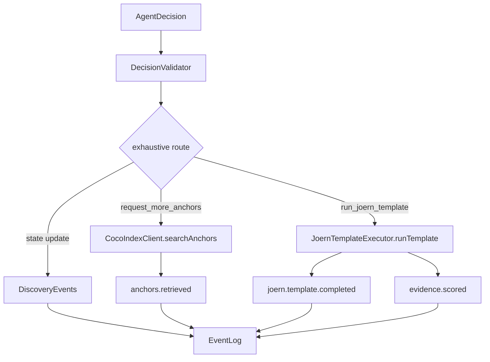

The Effect layer owns:

```txt
validation
routing
timeouts
retries
budgets
idempotency
event recording
projection freshness
```

CocoIndex and Joern are powerful services, but they are not allowed to mutate Attune state directly.

---

## 12. Failure modes and boundaries

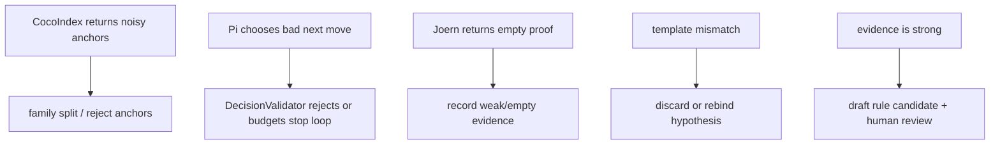

Important boundaries:

```txt
CocoIndex may be fuzzy.
Pi may be wrong.
Joern may return empty proof.
Effect must still record what happened.
Drizzle/atoms must rebuild the next view from durable state.
```

This is why the loop can run for many iterations without relying on chat memory.

---

## 13. Minimal v0 subsystem

The first working version only needs two paths.

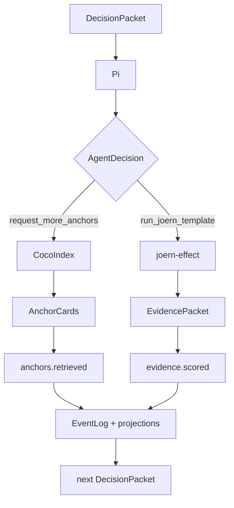

V0 does not need every template or every decision kind to prove the architecture.

It needs:

```txt
one search path
one proof path
one memory path
one refreshed decision packet
```

---

## 14. What gets generated

`joern-effect` is generation-heavy because templates, schemas, bindings, and evidence decoders should stay aligned.

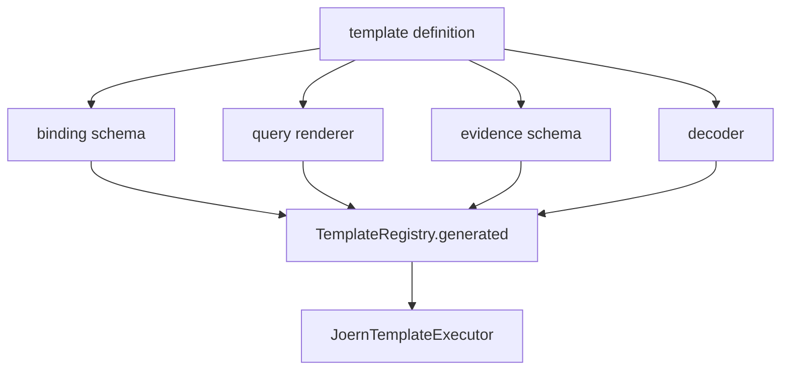

Nx generators should own the source-code grammar around this:

```txt
nx g @attune/nx:joern-template source_to_sink_flow
nx g @attune/nx:decision discovery run_joern_template
nx g @attune/nx:event discovery evidence.scored
```

The agent should not manually create the shape. It should run generators and fill in implementation details.

---

## 15. Final architecture sentence

Attune uses CocoIndex to discover the codebase’s local vocabulary and candidate anchors, then uses `joern-effect` to prove selected structural hypotheses with known typed templates. Effect coordinates the handoff through validated `AgentDecision` commands, records all outcomes as events, and rebuilds the next decision view from durable memory. The agent is useful because it chooses what to try next; the system is reliable because CocoIndex and Joern are wrapped in typed, deterministic boundaries.