**Status:** v0 performance architecture  
**Scope:** Attune Discovery runtime, CocoIndex, joern-effect, memory/caching, queues, and measurement  
**Goal:** keep the first implementation honest about where runtime and memory will actually go.

---

## 1. Core performance thesis

Attune Discovery is not primarily inference-bound.

It is **evidence-bound**.

Most agentic systems spend their budget waiting for model calls. Attune intentionally inverts that shape:

```txt
Most agent systems:
  expensive inference
    → cheap tool call
    → expensive inference
    → cheap tool call

Attune:
  expensive indexing / graph materialization
    → cheap bounded inference
    → expensive structural proof
    → cheap bounded inference
    → expensive retrieval or proof
```

The model is not the expensive center of the system. The expensive work is **materializing the codebase** and **proving structural relationships**.

```txt
The model is cheap.
The world is expensive.
```

That means v0 performance is not about making Pi smarter first. It is about making Pi a better scheduler for scarce evidence operations.

---

## 2. The v0 bottleneck model

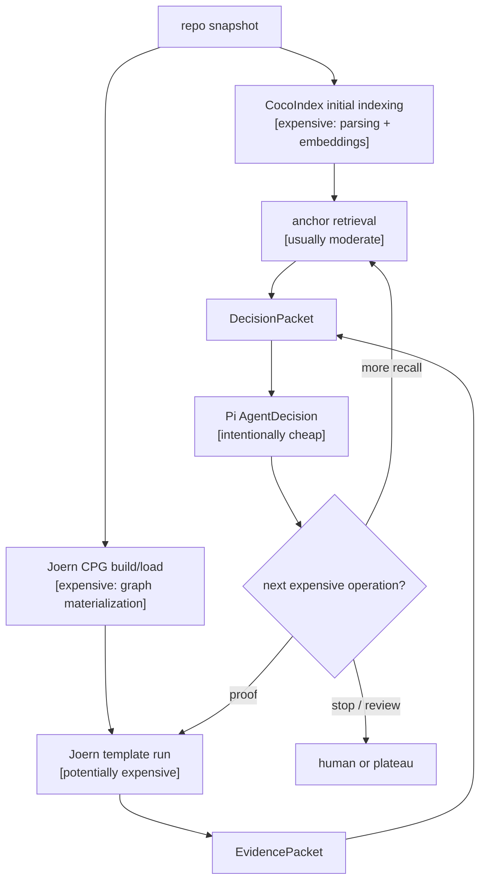

Expected local v0 bottleneck ranking:

```txt
1. Joern CPG build/import
2. Broad Joern template queries
3. CocoIndex initial indexing / embedding
4. Local embedding throughput
5. Repeated query embedding for similar searches
6. Vector lookup / anchor retrieval
7. Pi inference
8. EventLog / Drizzle / atoms
```

The important performance metric is not raw throughput. It is:

```txt
useful evidence per minute
```

More specifically:

```txt
useful EvidencePackets per Joern minute
new useful AnchorFamilies per CocoIndex minute
```

---

## 3. Runtime shape

The performance architecture should make expensive work explicit.

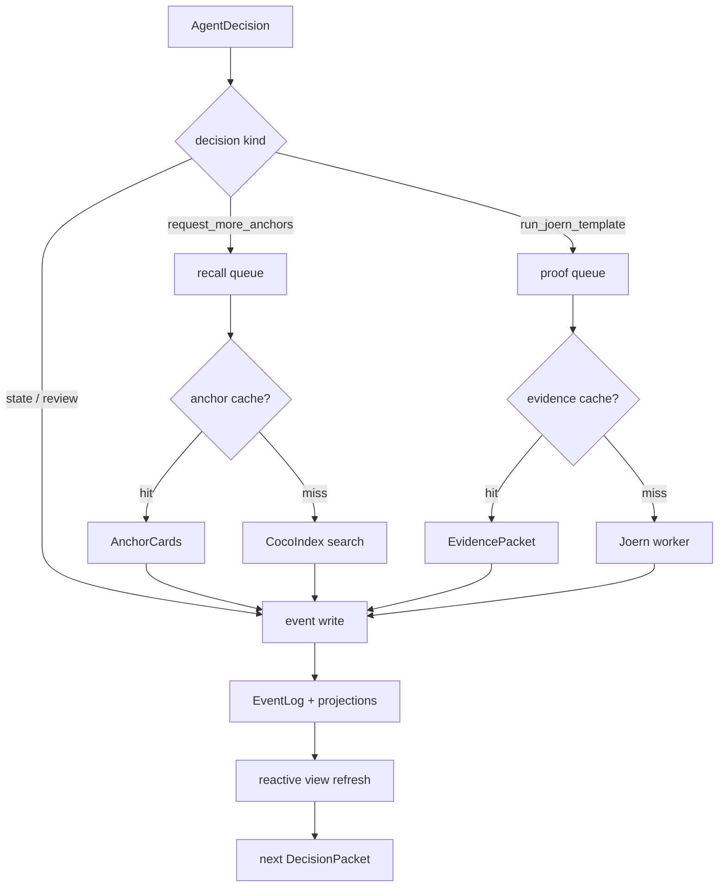

v0 should expose three bounded work classes:

```txt
indexing queue:
  ensure a repo snapshot is indexed and materialized

recall queue:
  bounded CocoIndex searches

proof queue:
  bounded Joern template runs
```

The workflow should not directly “just call Joern” or “just call CocoIndex” without passing through the cache/queue/resource boundary.

---

## 4. Memory thesis

Attune is memory-heavy by design because it trades inference-time reasoning for materialized codebase state.

```txt
Attune does not ask the model to remember the codebase.
It materializes the codebase, then asks the model what experiment to run next.
```

The system may hold several representations of the same repo:

```txt
repo files
  → CocoIndex chunks + embeddings
  → Joern CPG
  → EventLog facts
  → Drizzle projections
  → atom-derived run view
  → FoldKit explanation view
```

That is acceptable if ownership is explicit.

---

## 5. Memory ownership model

The most important distinction is **snapshot memory** vs **run memory**.

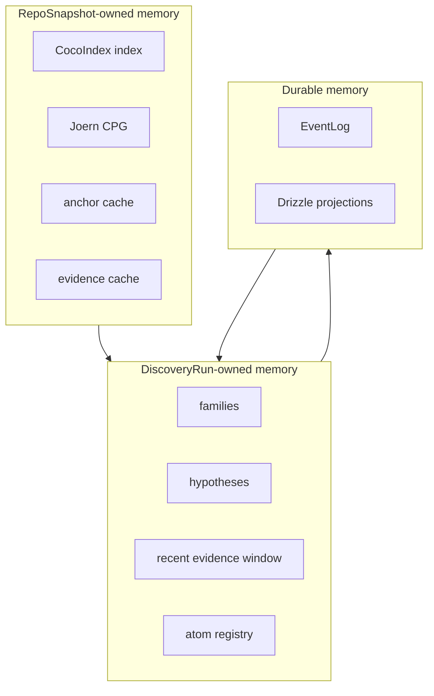

Rules:

```txt
RepoSnapshot owns expensive materialization.
DiscoveryRun owns temporary interpretation.
EventLog/Drizzle own replayable memory.
```

Do not let each run duplicate the whole world.

Bad:

```txt
run 1 loads repo, index, CPG
run 2 loads repo, index, CPG
run 3 loads repo, index, CPG
```

Better:

```txt
repo snapshot owns index + CPG
runs borrow bounded views over that snapshot
```

---

## 6. Hot / warm / cold memory

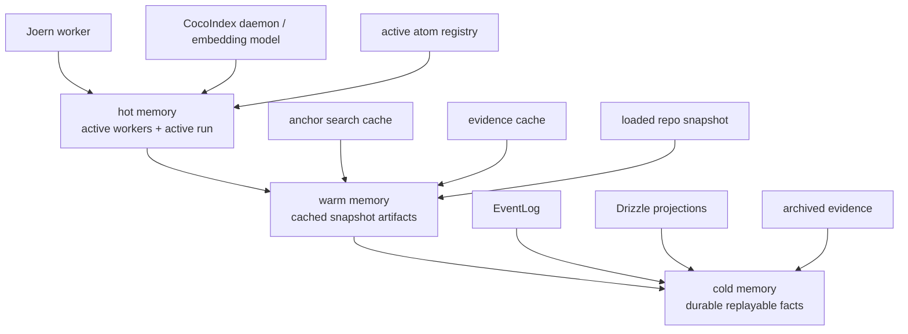

v0 rule:

```txt
Only active runs deserve hot memory.
Everything else should be evictable or replayable.
```

Practical policies:

```txt
- one active atom registry per active run
- dispose run registry on completion
- one warm CocoIndex index per repo snapshot
- one warm Joern worker per repo snapshot by default
- bounded number of active repo snapshots
- bounded recent evidence windows in DecisionPacket
- store references before snippets when possible
```

---

## 7. CocoIndex performance model

CocoIndex is the recall layer.

It answers:

```txt
What code might matter?
What anchors are near this motif?
What examples, wrappers, validators, sources, sinks, and counterexamples exist?
```

It has two performance paths:

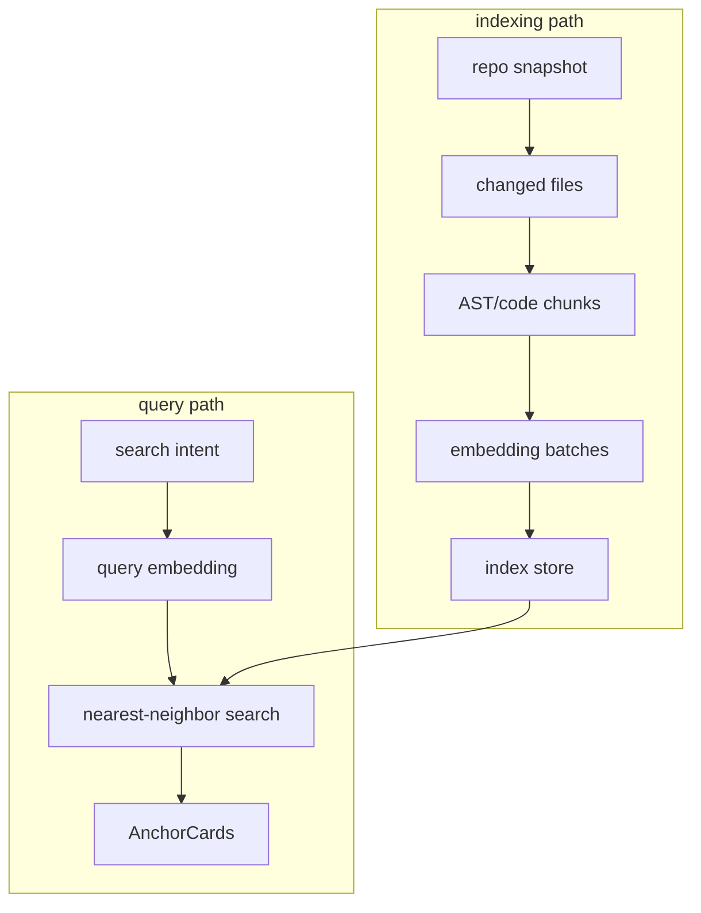

The main optimization is amortization:

```txt
Build once.
Keep warm.
Update incrementally.
Reuse across runs.
Cache repeated searches.
```

Embedding bottleneck expectations:

```txt
CPU local embeddings:
  parallel workers help until CPU saturation

GPU local embeddings:
  batching helps more than many independent workers

cloud embeddings:
  batching, rate limits, cost, and cache hit rate dominate
```

v0 recommendations:

```txt
- use repoSnapshotId as the cache key root
- normalize search queries before caching
- cache query embedding if easy
- cache AnchorCard results by query + filters + topK
- avoid duplicate searches from repeated agent decisions
- measure anchors returned and anchors later used in surviving hypotheses
```

---

## 8. Joern performance model

Joern is the proof layer.

It answers:

```txt
Does this structural relationship exist?
Does this source reach this sink?
Is this wrapper actually used around this primitive?
Does validation happen before use?
Does this boundary-crossing pattern appear in code?
```

The expensive work is graph materialization and broad graph traversal.

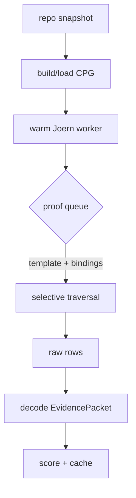

Joern should be scaled around independent proof jobs, not by assuming one interpreter is an infinitely concurrent query engine.

v0 assumption:

```txt
Joern parallelizes best across independent template runs / workers.
A single Joern process should be treated as a scarce stateful proof executor.
```

v0 recommendations:

```txt
- build/load CPG once per repo snapshot
- keep Joern warm while the run is active
- run only known templates
- make templates selective before expressive
- cache by repoSnapshotId + templateId + bindingsHash
- bound template runtime with timeout
- retry only carefully
- measure useful evidence per Joern minute
```

Do not do this:

```txt
for every hypothesis:
  start Joern fresh
  import repo fresh
  run broad generic query
  discard worker state
```

---

## 9. Proof worker pool shape

v0 can start with one worker. The architecture should still look like a pool.

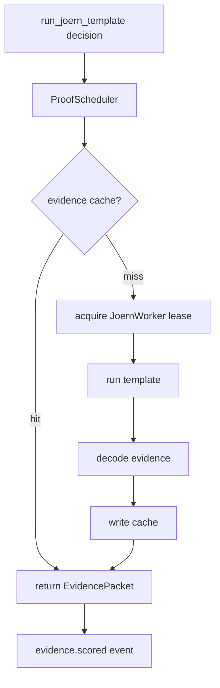

Worker scaling ladder:

```txt
v0 local:
  one warm Joern worker

serious local:
  small bounded pool, limited by RAM

later SaaS:
  per-snapshot worker leasing, eviction, cache reuse
```

RAM is the constraint. More workers may improve throughput but can multiply memory pressure.

Benchmark before assuming:

```txt
1 worker: p50/p95 template runtime, memory
2 workers: speedup, memory
4 workers: speedup, memory
```

Stop when throughput gain is not worth memory growth.

---

## 10. Cache plan for v0

Add these caches early. They are simple and directly tied to the evidence-bound loop.

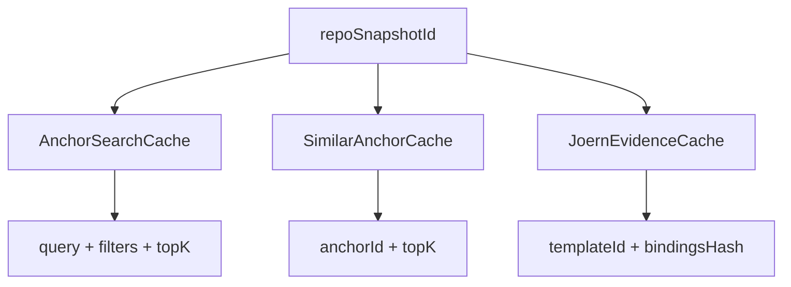

### AnchorSearchCache

Key:

```txt
repoSnapshotId + normalizedQuery + filters + topK
```

Value:

```txt
AnchorCard[]
```

Purpose:

```txt
Avoid repeated semantic searches from similar/repeated agent decisions.
```

### SimilarAnchorCache

Key:

```txt
repoSnapshotId + anchorId + topK
```

Value:

```txt
AnchorCard[]
```

Purpose:

```txt
Avoid repeated nearest-neighbor expansion around the same anchor.
```

### JoernEvidenceCache

Key:

```txt
repoSnapshotId + templateId + normalizedBindingsHash
```

Value:

```txt
EvidencePacket
```

Purpose:

```txt
Avoid rerunning proof for identical hypotheses.
```

Cache events should be observable:

```txt
anchor_cache.hit
anchor_cache.miss
evidence_cache.hit
evidence_cache.miss
```

---

## 11. Scheduling model

Pi should think like a scheduler for scarce evidence operations.

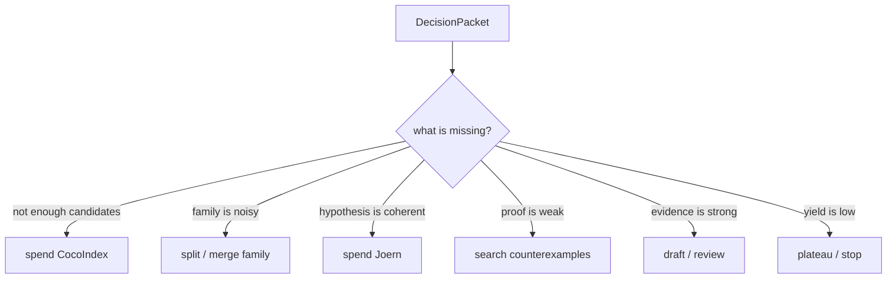

This suggests one key v0 score:

```txt
expected_evidence_yield
```

Not merely:

```txt
is this hypothesis plausible?
```

But:

```txt
is this hypothesis worth a Joern slot?
```

A good scheduler should maximize:

```txt
useful evidence / expensive operation
```

---

## 12. V0 budget model

Every run should have explicit budgets.

```txt
max_iterations
max_cocoindex_searches
max_joern_template_runs
max_wall_clock_minutes
max_active_hypotheses
max_recent_evidence_in_packet
max_anchor_cards_in_packet
max_prompt_tokens
```

Budget state should be present in the DecisionPacket.

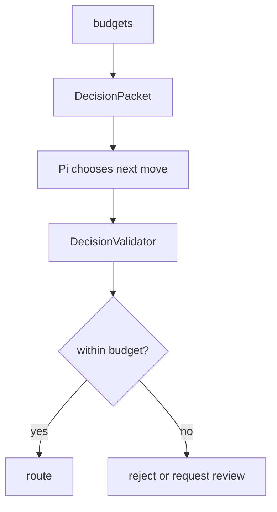

Suggested local v0 defaults:

```txt
max_iterations: 30
max_cocoindex_searches: 20
max_joern_template_runs: 10
max_wall_clock_minutes: 45
max_active_hypotheses: 20
max_recent_evidence_in_packet: 20
max_anchor_cards_in_packet: 60
```

For smoke tests:

```txt
max_iterations: 5
max_cocoindex_searches: 3
max_joern_template_runs: 2
max_wall_clock_minutes: 10
```

---

## 13. DecisionPacket size policy

Do not let the packet become the new context window problem.

The packet should summarize memory, not duplicate it.

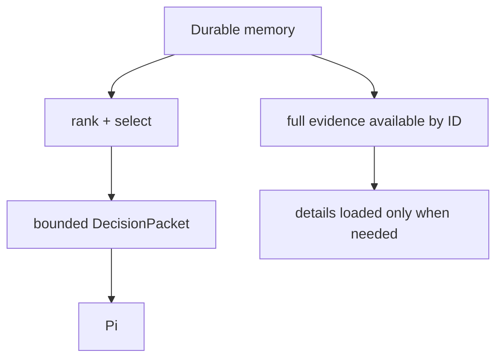

Packet rules:

```txt
- include IDs for all referenced durable facts
- include short snippets only when needed
- include top-ranked anchors, not every anchor
- include evidence summaries, not full evidence graphs
- include budget state
- include deterministic recommendation
- include why previous repeated decisions failed
```

Avoid duplicating code in many places:

```txt
AnchorCard has code snippet
EvidencePacket has selected proof snippets
FoldKit has presentation snippets
DecisionPacket has bounded excerpts
```

Prefer:

```txt
store references + bounded excerpts
load full detail by ID only when rendering or reviewing
```

---

## 14. Metrics

Benchmark Attune like a proof pipeline, not like a chatbot.

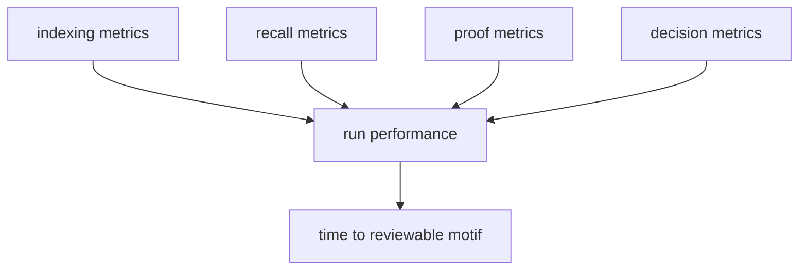

### Indexing metrics

```txt
time_to_index_snapshot
changed_files_reindexed
embedding_batch_latency
embedding_cache_hit_rate
index_size_mb
cocoindex_daemon_memory_mb
```

### Recall metrics

```txt
cocoindex_search_p50_ms
cocoindex_search_p95_ms
anchor_cache_hit_rate
anchors_returned_per_search
anchors_accepted_per_search
families_created_per_search
```

### Proof metrics

```txt
time_to_build_cpg
joern_worker_memory_mb
joern_template_p50_ms
joern_template_p95_ms
evidence_cache_hit_rate
evidence_packets_per_template_run
useful_evidence_per_joern_minute
failed_template_rate
```

### Decision metrics

```txt
Pi_decision_latency_ms
schema_validation_failure_rate
decision_rejection_rate
repeated_decision_count
decision_kind_distribution
```

### Loop metrics

```txt
iterations_per_run
time_to_first_useful_evidence
time_to_first_reviewable_candidate
useful_evidence_per_minute
new_family_yield_per_minute
plateau_reason_distribution
run_memory_peak_mb
```

The two most important metrics:

```txt
time_to_first_reviewable_candidate
useful_evidence_per_joern_minute
```

---

## 15. Observability spans

Create spans around expensive boundaries.

```txt
discovery.run
  discovery.iteration
    decision_packet.build
    pi.decide
    decision.validate
    decision.route
    cocoindex.search
    joern.template.run
    evidence.score
    eventlog.write
    projection.apply
    atom.evaluate
```

Each expensive span should include:

```txt
runId
repoSnapshotId
iteration
decisionKind
templateId, if relevant
cacheHit, if relevant
durationMs
memoryMb, if available
resultCount
status
```

For Joern:

```txt
repoSnapshotId
templateId
bindingsHash
workerId
cacheHit
durationMs
rowsReturned
evidenceStatus
memoryBeforeMb
memoryAfterMb
```

For CocoIndex:

```txt
repoSnapshotId
queryHash
filtersHash
topK
cacheHit
durationMs
anchorsReturned
embeddingProvider
```

---

## 16. What not to optimize in v0

Do not start here:

```txt
- multi-agent debate
- larger model selection
- prompt micro-optimization
- distributed Joern cluster
- perfect cache invalidation
- custom vector database work
- full SaaS tenant scheduler
- complex CPG sharding
- fine-tuning Pi
```

Start here:

```txt
- warm snapshot materialization
- evidence cache
- anchor search cache
- bounded queues
- Joern timeout
- packet size limits
- run memory disposal
- useful evidence metrics
```

The goal of v0 is not maximum throughput.

The goal is to prove the loop and learn where time/memory actually go.

---

## 17. V0 acceptance criteria

A performance-valid v0 should demonstrate:

```txt
1. Repo snapshot is indexed once and reused.
2. Joern CPG is built/loaded once and reused.
3. Repeated anchor searches hit cache.
4. Repeated template runs hit evidence cache.
5. DecisionPacket stays bounded.
6. Atom registry is disposed on run completion.
7. Joern template runs have timeout and measured duration.
8. CocoIndex searches have measured duration and result counts.
9. Run summary reports time, memory, cache hits, and evidence yield.
10. The system can identify plateau or low-yield loops.
```

The v0 run summary should answer:

```txt
How long did indexing take?
How long did CPG materialization take?
How many searches did we run?
How many proof jobs did we run?
How much evidence was useful?
How much was cached?
Where did we spend time?
Where did we spend memory?
Did we reach a reviewable candidate?
```

---

## 18. Final performance model

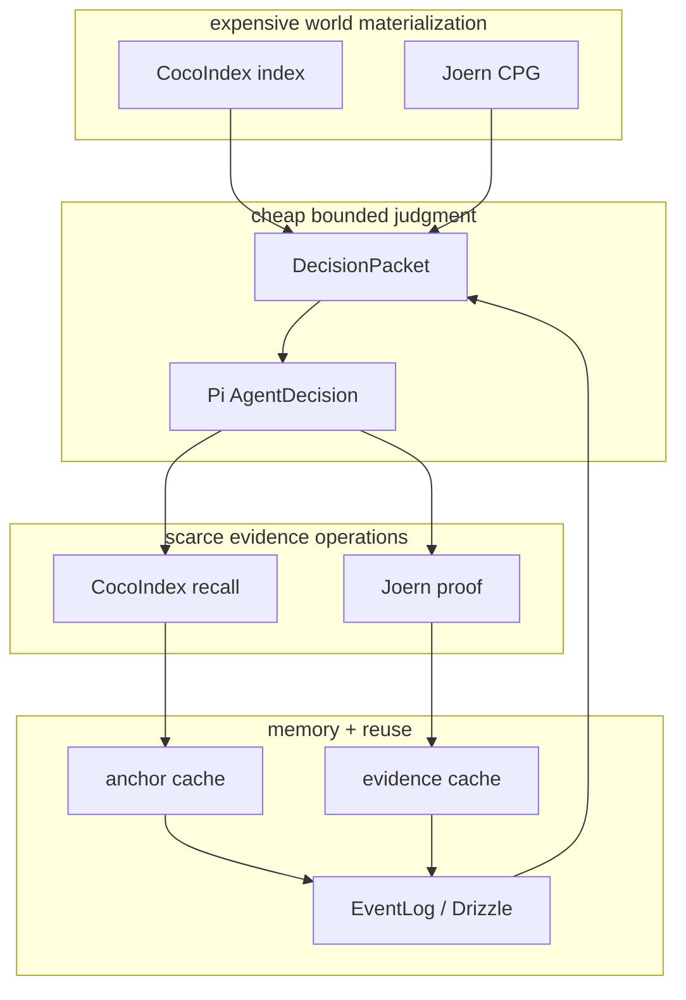

Attune Discovery v0 should be optimized around this sentence:

```txt
Spend inference cheaply to schedule expensive evidence work, then cache and remember every expensive result by repo snapshot.
```

Or shorter:

```txt
Pi spends judgment.
CocoIndex and Joern spend runtime.
EventLog and caches preserve the spend.
```