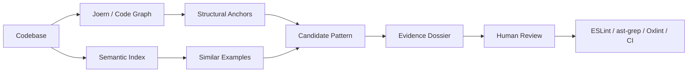

<!-- markdownlint-disable MD033 -->

# Attune

<p align="center">
  <strong>Discover the rules your codebase already knows.</strong>
</p>

<p align="center">
  <strong>Joern code graph</strong> → <strong>semantic memory</strong> → <strong>evidence dossier</strong> → <strong>deterministic checks</strong>
</p>

<p align="center">
  <a href="#why-attune">Why</a>
  ·
  <a href="#the-loop">Loop</a>
  ·
  <a href="#joern-effect">joern-effect</a>
  ·
  <a href="#product-surface">Product</a>
  ·
  <a href="#current-status">Status</a>
</p>

---

Attune is a work-in-progress developer tool for discovering **codebase-specific engineering patterns** and preserving them as **deterministic checks** that humans, CI, and AI agents can all use.

Every mature codebase has rules that generic tooling cannot fully know:

- which imports are suspicious
- which boundaries should not be crossed
- which patterns are safe in one layer but dangerous in another
- which review comments keep repeating
- which abstractions carry local meaning
- which examples explain how the system wants to be changed

Most of that knowledge lives in people’s heads, review threads, docs, scattered examples, and vibes.

Attune turns that knowledge into inspectable artifacts.

```text
code graph
  ↓
semantic neighborhood
  ↓
candidate pattern
  ↓
evidence dossier
  ↓
deterministic check
```

The agent should not have to relearn your codebase every time.

The team should not have to trust vibes.

## Why Attune

AI coding agents are getting better at producing code, but real repositories are not just bags of files.

They are living systems with local laws.

A senior engineer might know:

> UI code should not import server-only modules.

or:

> Request validation should not write to the database.

or:

> This package is pure; effects belong at the edge.

or:

> Provider calls must decode, map errors, and emit trace spans before leaving the service boundary.

Those rules are often obvious to the team and invisible to a generic model.

Attune exists to make that local knowledge durable.

It studies a repository through structural and semantic views, helps surface repeated patterns, gathers evidence, and lowers accepted practices into deterministic checks that can run in familiar tools such as **ESLint**, **ast-grep**, **Oxlint**, or CI.

The goal is not to replace human judgment.

The goal is to preserve the judgment a team has already developed.

## The loop

Attune is built around an optimization loop for codebase knowledge.

```text
observe repository
→ find structural anchors
→ retrieve similar examples
→ form a candidate pattern
→ test the pattern against the repo
→ validate edge cases
→ export a deterministic check
```

A rule does not become trustworthy because an agent wrote it.

A rule becomes useful when it survives contact with the codebase.



The exact ranking, refinement, and promotion strategies are product machinery. The public shape is simpler:

> Use agents to explore and explain.  
> Use static analysis to ground.  
> Use deterministic checks to preserve.

## Two views of the codebase

Attune combines two complementary views.

### Structural view

A codebase is not just text.

It has calls, imports, definitions, flows, packages, framework edges, generated code, and local architectural boundaries.

Attune uses a code property graph layer, powered by **Joern**, to make that structure queryable.

Instead of asking an agent to infer everything from raw text, Attune can ask questions like:

```text
Where does request input flow?
Which calls cross this package boundary?
What methods reach this sink?
Which provider calls are missing protocol steps?
Which throwable operations escape an Effect safety boundary?
```

### Semantic view

A codebase is also not just a graph.

Teams recognize patterns through examples: nearby code, similar call sites, repeated review comments, naming conventions, domain concepts, and “this looks like that” intuition.

Attune keeps a semantic memory over code examples and pattern evidence so it can connect related cases that may not share the same syntax.

```text
structural query finds the shape
semantic memory finds the family
evidence decides whether the pattern is real
```

## joern-effect

The deepest technical layer today is `joern-effect`.

`joern-effect` is a typed TypeScript and Effect interface over Joern / CPGQL. Joern remains the static-analysis engine; `joern-effect` provides the authoring surface, generated schemas, evidence projection, and Effect-managed runtime lifecycle.

The query should read like the evidence it is trying to produce.

```ts
import { Effect } from "effect"
import { CpgProgram, GraphWeights, Joern, cpg } from "joern-effect"

export const requestInputToProcessExecution = CpgProgram.effect(
  "request input reaches process execution",
  Effect.gen(function* () {
    const source = yield* cpg.method
      .parameter
      .name("req|request|ctx")
      .as("request source")

    const sink = yield* cpg.call
      .name("exec|spawn|eval")
      .argument
      .index(1)
      .as("process execution argument")

    const flows = yield* sink
      .reachableByFlows(source)
      .as("source-to-sink data-flow paths")

    const graph = yield* flows
      .materializeGraph("source-to-sink evidence graph")
      .includingPath()
      .including((node) => node.controlledBy)
      .including((node) => node.method)

    const shortestExplanation = yield* graph
      .paths
      .shortest()
      .from(source)
      .to(sink)
      .weightedBy(GraphWeights.preferDataFlowEdges())
      .as("shortest explanation path")

    return yield* shortestExplanation
      .toFindings()
      .withSource(source)
      .withSink(sink)
      .withFlow(flows)
      .withRoot(sink)
  }),
)

export const runRequestInputToProcessExecution = (repoPath: string) =>
  CpgProgram.run(requestInputToProcessExecution).pipe(
    Effect.provide(Joern.layer({ repoPath })),
  )
```

That program is not just a text query.

It names the source, the sink, the data-flow path, the evidence graph, and the shortest explanation path. Those names matter because Attune is not only trying to find matches. It is trying to create reviewable evidence.

```text
source ──data flow──▶ sink
   │                    │
   └──── evidence graph ┘
              ↓
       shortest explanation
              ↓
          findings
```

Other useful program shapes include:

| Program shape | What it asks |
| --- | --- |
| Source → sink flow | Does user-controlled input reach a dangerous operation? |
| Effect safety boundary | Does a throwable operation escape the typed error channel? |
| Provider protocol deviation | Does an AI/provider call skip decode, error mapping, or tracing steps? |
| Import boundary | Does code cross a layer boundary the team cares about? |
| Deprecated path | Does a local abstraction still flow into old code? |

This is the bridge from codebase structure to product evidence.

## What Attune produces

Attune is not just a chat interface over a repository.

The durable outputs are artifacts a team can inspect, review, diff, and keep.

### Candidate patterns

A candidate pattern captures a practice the team may want to preserve.

It should explain:

- what the pattern is
- why it matters
- where it appears
- where it should not apply
- what evidence supports it
- what uncertainty remains

### Evidence dossiers

Attune should show its work.

Evidence may include:

- matching examples
- near misses
- counterexamples
- affected files
- related symbols
- source/sink paths
- structural neighborhoods
- semantic neighbors
- known limits
- reviewer decisions

The evidence is the difference between “the model said so” and “the team can review this.”

### Deterministic checks

Accepted patterns should become deterministic checks.

Depending on the rule, that might mean:

- an ESLint rule
- an ast-grep rule
- an Oxlint-backed check
- a CI-only policy
- a repo-local verification script

The backend matters less than the boundary:

```text
agent discovery is provisional
deterministic enforcement is reviewable
```

### Clean exports

Attune should keep the repository clean.

The repo should receive the accepted rule, fixtures, docs, and CI wiring needed to enforce the decision.

Private exploration history, rejected candidates, prompt traces, and internal lineage should stay outside the exported artifact unless the team explicitly chooses otherwise.

## Product surface

Attune’s product surface is a calm review workflow, not a dashboard.

```text
Discover  →  Workbench  →  Findings  →  Lineage  →  Exports
                         ↘
                          Settings
```

### Discover

Choose which pattern deserves inspection.

Discover is a pattern shelf plus a selected dossier. It should help a team decide what is worth opening, not bury them in scan results.

### Workbench

Inspect and revise one candidate artifact.

The Workbench should make the important parts visible:

```text
Looks like        Does not look like        Deterministic rule
```

Chat is allowed to be a control surface.

The artifact is the product.

### Findings

Review what the deterministic check touched.

Findings is a queue plus a selected finding dossier: code excerpt, why it matched, and simple review decisions.

### Lineage

Understand how a candidate evolved.

Lineage should explain what changed and why it became more trustworthy. It should not become an event-log firehose.

### Exports

Review the clean repo artifact.

Exports is where the accepted rule becomes a patch, draft PR, fixture set, or CI check.

### Settings

Define the boundaries.

Settings controls what Attune can inspect, what tools it may use, what the agent may propose, what requires human review, and how exports are allowed to happen.

## Validation

Property-based testing still matters in Attune, but it is not the discovery engine.

Its role is validation.

Once a candidate pattern exists, generated cases and near-misses can help answer:

- Where does this rule break?
- What does it falsely flag?
- What does it miss?
- Which edge cases matter?
- Is the rule too broad?
- Is the evidence strong enough to show a human?

FastCheck-style validation helps make candidate checks harder to fool before they are promoted.

It is one layer in the evidence pipeline, not the core source of discovery.

```text
Joern + semantic memory discover
repository measurement grounds
examples and generated cases validate
humans promote
deterministic tooling enforces
```

## SearchBench origin

Attune grew out of SearchBench.

SearchBench was an evaluation harness for agent-facing code-search interfaces. It asked whether structured codebase interfaces could make the same model cheaper, more reliable, and easier to reason about than simply handing it Bash.

SearchBench made several instincts concrete:

```text
measure before trusting
compare before claiming improvement
keep artifacts reviewable
separate agent behavior from deterministic evidence
make cost and evidence visible
export durable artifacts instead of vibes
```

The important lesson was not only that code search can be evaluated.

The important lesson was that agents need durable interfaces to codebases.

```text
SearchBench:
  Which interface made the same agent perform better?

Attune:
  Which codebase patterns should become durable interfaces?
```

SearchBench measured how agents search.

Attune gives them better structure to search through.

## What Attune is not

Attune is not:

```text
an AI code reviewer
an ast-grep GUI
an ESLint rule marketplace
a generic scan-results dashboard
an agent observability tool
a compliance console
```

Attune is:

```text
an agent-assisted workbench for discovering, reviewing, and preserving
serious static-analysis policy from real team practice.
```

## Current status

Attune is early and under active consolidation.

The project is currently in the middle of a migration away from Buck2-era orchestration toward an Nx-centered monorepo. Some Buck2 and Nix machinery remains because it still carries useful execution knowledge while the package graph is being reshaped.

The most substantial implementation tracks are:

| Area | Role |
| --- | --- |
| `packages/joern-effect` | Typed Effect interface over Joern, CPGQL, generated schemas, graph materialization, and Joern runtime lifecycle |
| `packages/fork` | Phase-aware static analysis engine for Attune’s own code and future repo-specific policy checks |
| `packages/eventing` | Typed event envelopes, redaction, and shared telemetry/event sinks |
| `packages/joern-effect/harness/source-sink` | Source/sink scenarios and validation harnesses for Joern-backed evidence |
| `nix/` | Reproducible toolchains and lab commands for Joern, Node, Postgres/pgvector, local model experiments, and validation runs |
| FoldKit UI track | Product surfaces for Discover, Workbench, Findings, Lineage, Exports, and Settings |
| Nx migration | Target workspace/task graph for the consolidated Attune monorepo |

The repository shape is still moving.

The product boundary should not:

```text
discover codebase knowledge
ground it in graph and semantic evidence
preserve accepted patterns as deterministic checks
```

## Development notes

The current implementation is TypeScript-first and Effect-native.

The important design constraints are:

- Joern owns deep static-analysis structure.
- Effect owns runtime lifecycle, typed errors, services, and composition.
- Semantic memory groups examples and evidence.
- Deterministic tools enforce only what survives review.
- FoldKit keeps the UI artifact-first and state-explicit.
- Eventing makes product history inspectable without leaking secrets.
- Nix keeps heavyweight toolchains reproducible while the workspace migrates.
- Nx is the intended monorepo control plane.

The machinery underneath can be deep.

The product surface should stay simple.

## Module

```text
github.com/becker63/attune
```
